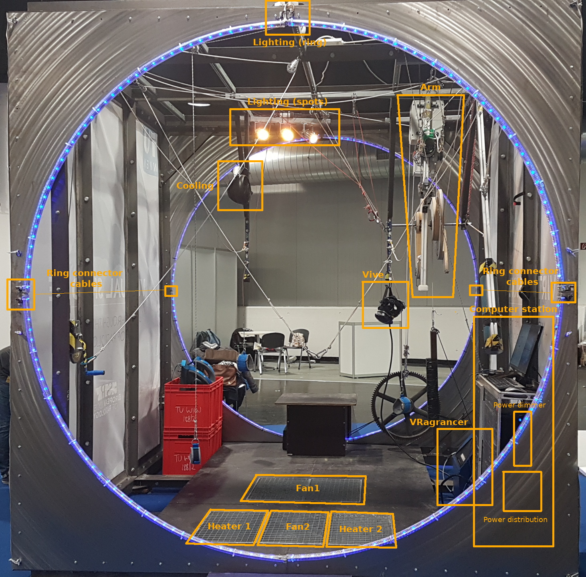
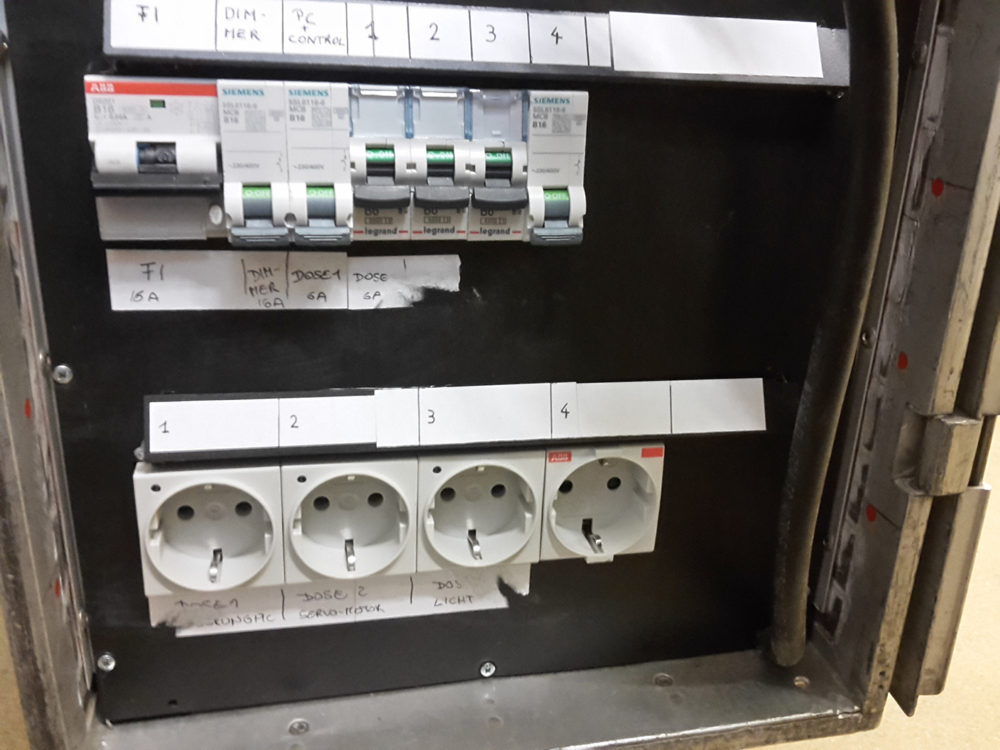
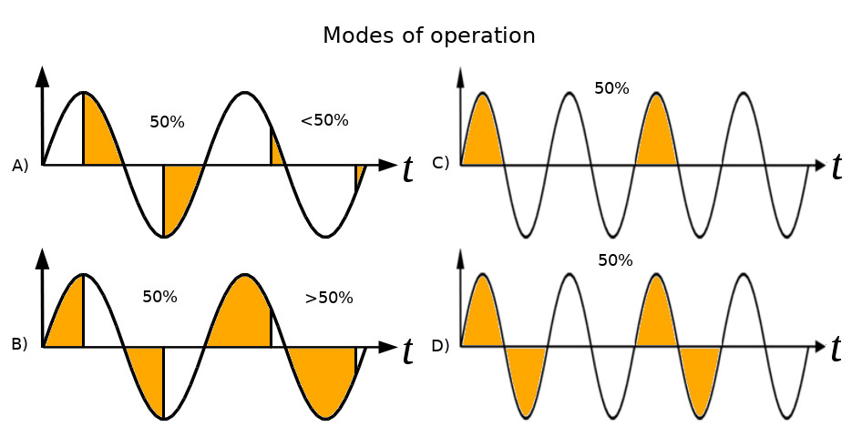
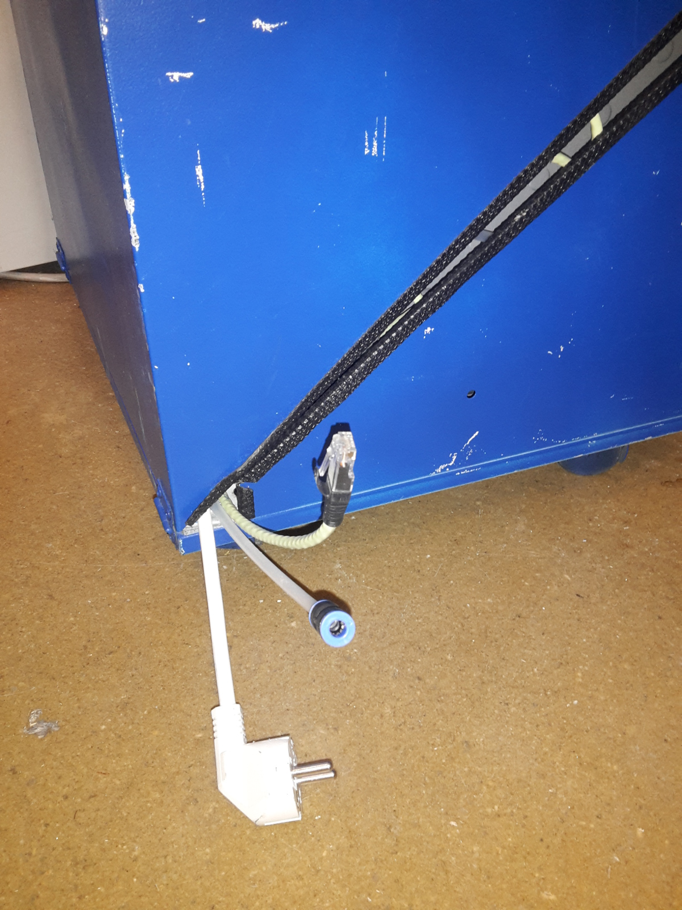

# JumpCube Electrical Documentation

The JumpCube consists of several electrical components, each of which consists
of different parts. This documentation lists all electrical components 
and explains in detail each component in its section, including hardware and software.

## Components

The following is a list of components that can be found on the following two pictures.

* Computing station
* Vive
* Arm
* Flight controller
* VRagrancer
* Lighting
    * Spots
    * Ring
    * Ring connector cables
* Cooling
* Fans
	* Fan 1
	* Fan 2
* Heating
	* Heater 1
	* Heater 2

## Computing Station

TODO: Insert a picture of the ComputingStation

The computing station consists of:

* Power distribution
* Power dimmer
* Computer
* Monitor
* Mouse and Keyboard
* Microphone
* Vive Connect Box
* Router
* Power supplies
	* Monitor
	* RaspberryPI
	* Router
	* Vive

### Connections

| Name             | Description                             |
|------------------|-----------------------------------------|
| Mains Power plug | Goes to main power source               |
| LAN              | LAN switch                              |
| HDMI/USB         | Connects Vive Connect Box with the Vive |

### Power Distribution

The power distribution features a residual-current device, multiple circuit 
breakers and power sockets. Power is fed from a thick cable with a Schuko AC plug,
ranging out of the box from the lower right corner. This device is 
current limited to 16A single phase through the residual current device.

| Label       | Description                                                                       |
|-------------|-----------------------------------------------------------------------------------|
| FI          | Residual current device 16A, Main, other circuit breaker are connected to this FI |
| DIMMER      | Circuit breaker 16A, feeds power to the power dimmer                              |
| PC+ CONTROL | Circuit breaker 16A, feeds power to the internal plug strip                       |
| 1, 2, 3     | Circuit breaker 10A, feeds power to sockets 1, 2, 3                               |
| 4           | Circuit breaker 16A, feeds power to socket 4                                      |

#### Connections

| Socket label | Description      |
|--------------|------------------|
| 1            | Servo motor      |
| 2            | Lighting         |
| 3            | Vive Lighthouses |
| 4            | VRagrancer       |

### Power Dimmer

The power dimmer provides 5 channel PWM controlled 230V~ power sockets, through
Solid State Relays controlled via a Arduino. The RPi running vj-control-server
talks to the Arduino via USB with a serial protocol. Each channel features multiple
phase angle control modes that can be set individually.

The following is a description of the individual modes. The letters refer to the
mode in the preceding image, showing the different modes of operation.

| Mode                | Description      |
|---------------------|------------------|
| NO_FIRE             | Channel disabled |
| PHASE_TRAILING_EDGE | A                |
| PHASE_LEADING_EDGE  | B                |
| HALF_WAVE_BURST     | C                |
| FULL_WAVE_BURST     | D                |

#### Connections

TODO: list connections

#### Sources

Schematic, board layout and Arduino compatible firmware can be found at the 
github repository https://github.com/flozzone/ssr-dimmer-board

### Flight controller

The Gyrosensor delivers the actual roll position of the person directly to the computer via a USB cable
using a serial protocol. It consists of a Arduino Nano running the vj-flight-controller firmware
and the gyrocope module.

#### Connections

| Name | Description                      |
|------|----------------------------------|
| USB  | Computer in the computer station |

#### Sources

Sources for the vj-flight-controller firmware and a library to communicate to the
vj-flight-controller from Unity can be found at the github repository
https://github.com/j-be/vj-flight-controller

## Arm

The arm contains the servo motor, controller, RPi, Arduino Nano, Rotary encoder,
a magnetic clutch and circuit breakers for the clutch.

* Servo motor: Maxxon EC 60 flat 408057
* Servo controller: Maxxon EPOS 24/5

The Arduino runs the vj-servo-controller Arduino firmware and sends rotary positions
read from the rotary encoder and sends them to the RPi.

### Sources

Sources for the Arduino firmware can be found at https://github.com/j-be/vj-servo-controller/tree/master/Arduino
While sources for the RPi can be found in the root of the repository https://github.com/j-be/vj-servo-controller
Schematics are located at https://github.com/j-be/vj-servo-controller/tree/master/hw

### Connections

| Name       | Description                  |
|------------|------------------------------|
| Power plug | Power distribution socket 1  |
| LAN        | LAN switch                   |

## VRagrancer

The VRagrancer is able to produce smells using a compressor, scent capsules,
power supply and valves. It is controlled by a RPi running the 
vj-aerome-scent-controller software.

### Connections

As depicted in the figure above, the VRagrancer is connected with

| Name       | Description                                                     |
|------------|-----------------------------------------------------------------|
| Power plug | Power distribution socket 4                                     |
| LAN        | LAN switch                                                      |
| Tube       | Connected to the tube in the cable bundle that goes to the Vive |

### Sources

Schematic and software sources can be found at the github repository https://github.com/j-be/vj-aerome-scent-controller

## Lighting

* Light Spots
* Led ring

### Connections

| Name               | Description                                            |
|--------------------|--------------------------------------------------------|
| Power              | Power distribution socket  2                           |
| LED Ring connector | connecting 2* 1/4 LED ring together to form a 1/2 ring |
| LED Ring controller| Connect 1/2 LED ring with one controller               |

## Cooling

### Connections

Connected with the lighting equipment

| Name  | Description                  |
|-------|------------------------------|
| Power | Power distribution socket  2 |

