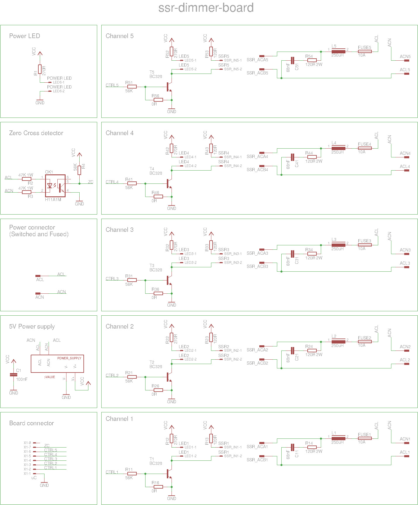
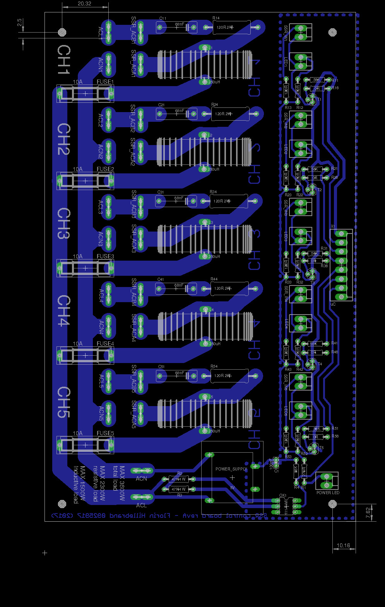
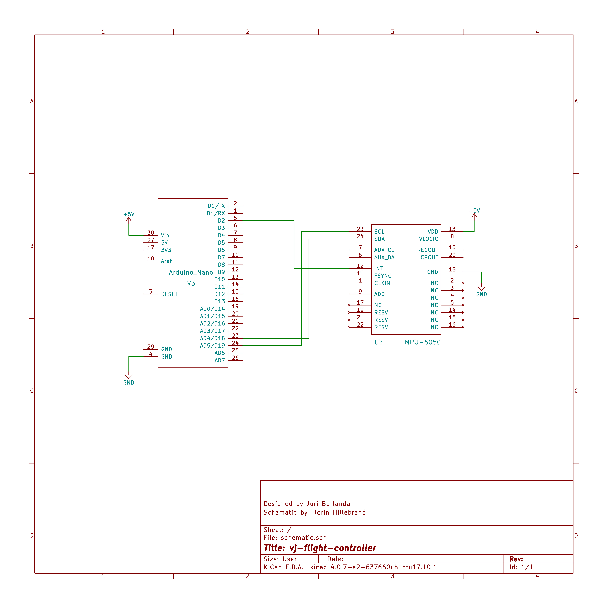
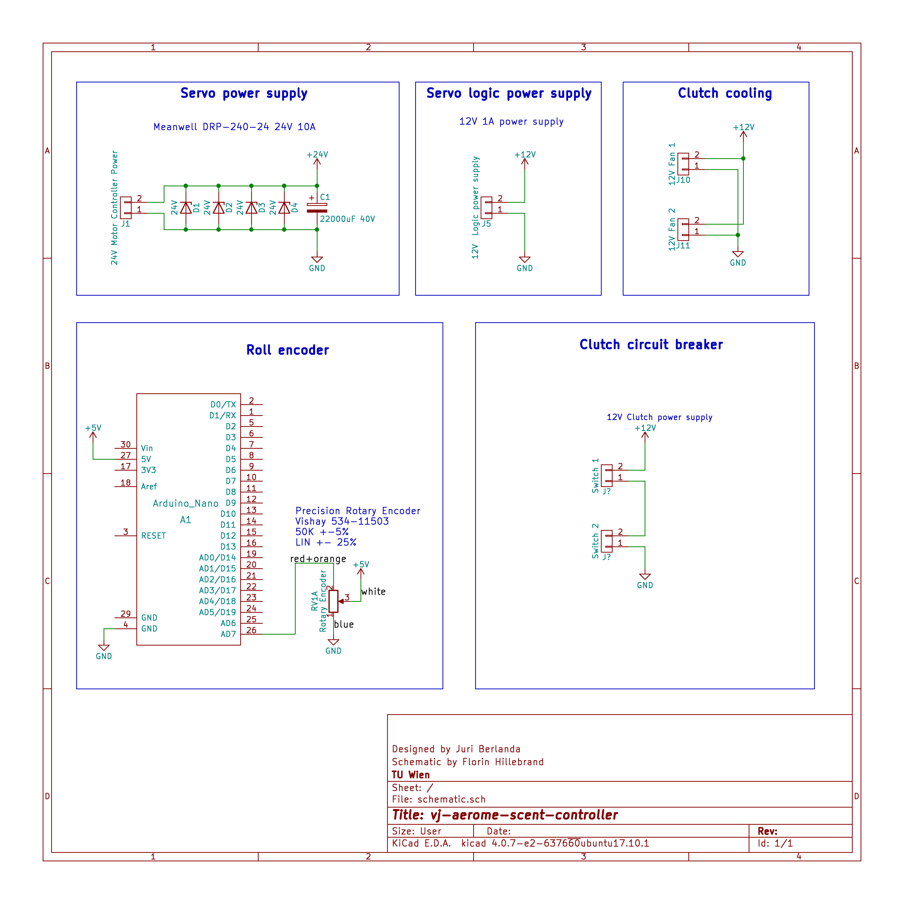

# JumpCube Electrical Documentation

The JumpCube consists of several electrical components, each of which consists of different parts. This documentation 
lists all electrical components and explains in detail each component in its section, including hardware and software.

This document is written in markdown and is located at

https://github.com/flozzone/jumpcube-doc/wiki

## Components

The following is a list of components that can be found in the following two photos.

* Computing station
* Vive
* Arm
* Flight controller
* VRagrancer
* Power distribution
* Power dimmer
* Lighting
    * Spots
    * Ring
    * Ring connector cables
* Cooling
* Fans
	* Fan 1
	* Fan 2
* Heating
	* Heater 1
	* Heater 2

## Computing Station

TODO: Florin: Insert a picture of the ComputingStation

The computing station consists of:

* Power distribution
* Power dimmer
* Computer
* Monitor
* Mouse and Keyboard
* Microphone
* Vive Connect Box
* Router (LAN switch)
* Power supplies
	* Monitor
	* RaspberryPI
	* Router
	* Vive

### Control server

The control server is the software that runs on a RPi located inside the computing station and provides a web interface
to the user to access the following components: servo controller, VRagrancer and the power dimmer.

#### Software sources

TODO Juri: README

Software sources can be found at https://github.com/j-be/vj-control-server

### Connections

| Name             | Description                             |
|------------------|-----------------------------------------|
| Mains Power plug | Goes to main power source               |
| LAN              | LAN switch                              |
| HDMI/USB         | Connects Vive Connect Box with the Vive |

## Power Distribution

The power distribution features a residual-current device, multiple circuit breakers and power sockets. Power is fed from 
a thick cable with a Schuko AC plug, ranging out of the box from the lower right corner. This device is current limited 
to 16A single phase through the residual current device.

| Label       | Description                                                                       |
|-------------|-----------------------------------------------------------------------------------|
| FI          | Residual current device 16A, Main, other circuit breaker are connected to this FI |
| DIMMER      | Circuit breaker 16A, feeds power to the power dimmer                              |
| PC+ CONTROL | Circuit breaker 16A, feeds power to the internal plug strip                       |
| 1, 2, 3     | Circuit breaker 10A, feeds power to sockets 1, 2, 3                               |
| 4           | Circuit breaker 16A, feeds power to socket 4                                      |

### Connections

The connections listed below are just a proposal and can be changed individually. But the VRagrancer needs the 16A circuit 
breaker, because it contains a compressor. A 10A circuit breaker would open when the compressor starts up.

| Socket label | Description      |
|--------------|------------------|
| 1            | Servo motor      |
| 2            | Lighting         |
| 3            | Vive Lighthouses |
| 4            | VRagrancer       |

## Power Dimmer

The power dimmer provides 5 channel PWM controlled 230V~ power sockets, through Solid State Relays controlled via a 
Arduino. The RPi running vj-control-server talks to the Arduino via USB with a serial protocol. Each channel features 
multiple phase angle control modes that can be set individually. Each channel is fused separately with an 10A fuse.

The following is a description of the individual modes. The letters refer to the mode in the preceding image, showing 
the different modes of operation.

| Mode                | Description      |
|---------------------|------------------|
| NO_FIRE             | Channel disabled |
| PHASE_TRAILING_EDGE | A                |
| PHASE_LEADING_EDGE  | B                |
| HALF_WAVE_BURST     | C                |
| FULL_WAVE_BURST     | D                |

### Connections

| Label               | Description      |
|---------------------|------------------|
| F                   | Fans             |
| H                   | Heating          |
| W                   | Water            |

Since there are two fans, both are connected together using a power strip and plugged in to the socket with label 'F'.

There are also two heaters, both are connected together using a power strip and plugged in to the socket with label 'H'.

### Schematic

Eagle schematic can be found at https://github.com/flozzone/ssr-dimmer-board/tree/master/hw

### Layout

Eagle board layout can be found at https://github.com/flozzone/ssr-dimmer-board/tree/master/hw

### Software sources

Arduino compatible firmware and documentation can be found at the github repository 
https://github.com/flozzone/ssr-dimmer-board/tree/master/src

## Flight controller

The Gyrosensor delivers the actual roll position of the person directly to the computer via a USB cable using a serial 
protocol. It consists of a Arduino Nano running the vj-flight-controller firmware and the gyrocope module.

### Connections

| Name | Description                      |
|------|----------------------------------|
| USB  | Computer in the computer station |

### Schematic

KiCad schematic is located at https://github.com/j-be/vj-flight-controller/tree/master/hw

### Layout

There is no board layout since the gyrosensor is available as a breakout board and just has to be sticked on the arduino.

### Software sources

TODO Juri: README

Sources for the vj-flight-controller firmware and a library to communicate to the vj-flight-controller from Unity can 
be found at the github repository https://github.com/j-be/vj-flight-controller

## Arm

The arm contains the servo motor, controller, RPi, Arduino Nano, Rotary encoder, a magnetic clutch and limit switches 
for the clutch.

* Servo motor: Maxxon EC 60 flat 408057
* Servo controller: Maxxon EPOS 24/5

The Arduino runs the vj-servo-controller Arduino firmware and sends rotary positions read from the rotary encoder and 
sends them to the RPi.

### Connections

| Name       | Description                  |
|------------|------------------------------|
| Power plug | Power distribution socket 1  |
| LAN        | LAN switch                   |

### Schematic

KiCad schematic is located at https://github.com/j-be/vj-servo-controller/tree/master/hw

### Layout

There is no board layout since the parts are directly wired to the arduino.

### Software sources

TODO Juri: README

Sources for the Arduino firmware can be found at https://github.com/j-be/vj-servo-controller/tree/master/Arduino
While sources for the RPi can be found in the root of the repository https://github.com/j-be/vj-servo-controller

## VRagrancer

The VRagrancer is able to produce smells using a compressor, scent capsules, power supply and valves. It is controlled 
by a RPi running the vj-aerome-scent-controller software.

### Connections

As depicted in the figure above, the VRagrancer is connected with

| Name       | Description                                                     |
|------------|-----------------------------------------------------------------|
| Power plug | Power distribution socket 4                                     |
| LAN        | Goes to LAN switch                                              |
| Tube       | Connected to the tube in the cable bundle that goes to the Vive |

### Schematic

KiCad schematic can be found at https://github.com/j-be/vj-aerome-scent-controller/tree/master/hw

### Layout

There is no board layout for this component, because parts are soldered on a breadboard.

### Software Sources 

TODO Juri: README

Software sources and documentation can be found at the github repository https://github.com/j-be/vj-aerome-scent-controller

## Lighting

* Light Spots
* Led ring

### Connections

#### Led ring

The led ring consists of 4 parts on each side, while each part is a 1/4 led ring (means 8 * 1/4 led ring). Two 1/4 parts 
are connected together using the led ring connector (see the "ring connector cable" in the first photo) and are controlled 
by one led controller (means 4 * controller for 1/2 led ring each). 

| Name               | Description                                            |
|--------------------|--------------------------------------------------------|
| Power              | Power distribution socket  2                           |
| LED Ring connector | connecting 2* 1/4 LED ring together to form a 1/2 ring |
| LED Ring controller| Connect 1/2 LED ring with one controller               |

## Cooling

This is the fan as depicted in the first figure, that cools the attendant while the preparation phase.

### Connections

Connected with the lighting equipment

| Name  | Description                  |
|-------|------------------------------|
| Power | Power distribution socket  2 |

## Repository summary

Components not listed here don't contain source code.

| Component name    | Link                                               |
|-------------------|----------------------------------------------------|
| Arm               | https://github.com/j-be/vj-servo-controller        |
| Flight controller | https://github.com/j-be/vj-flight-controller       |
| VRagrancer        | https://github.com/j-be/vj-aerome-scent-controller |
| Power dimmer      | https://github.com/flozzone/ssr-dimmer-board       |
| Control server    | https://github.com/j-be/vj-control-server			 |

